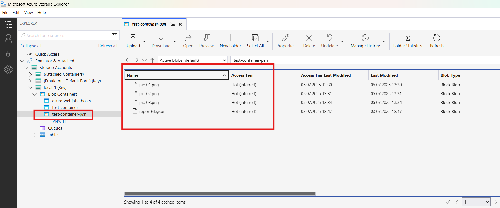
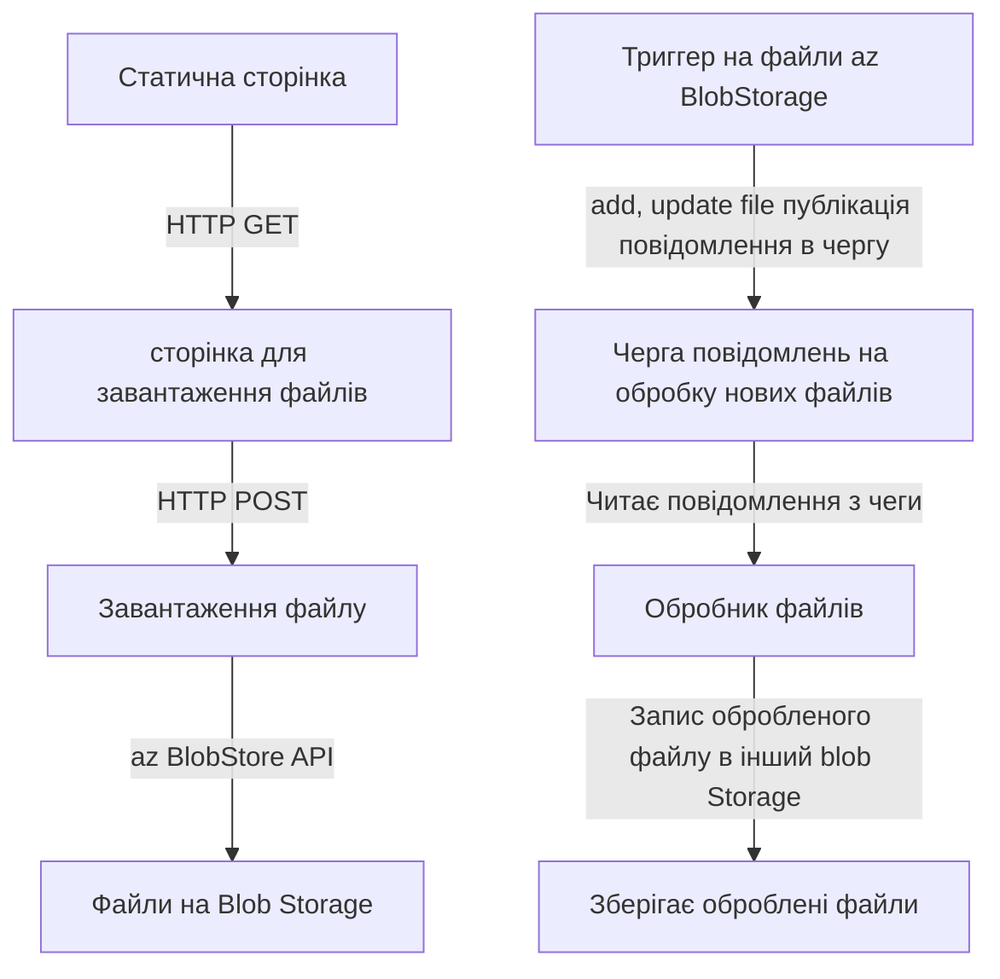
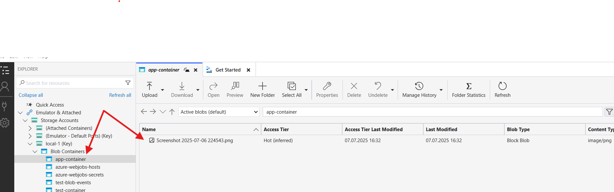
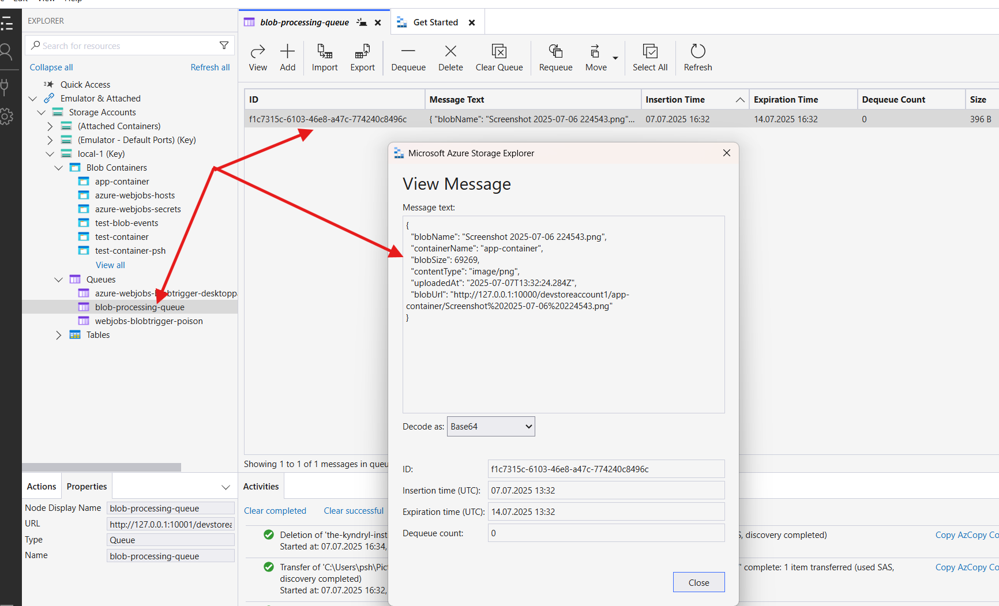
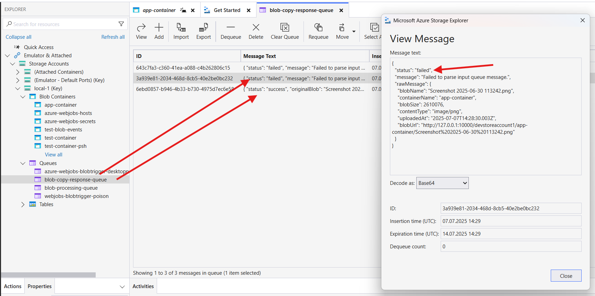
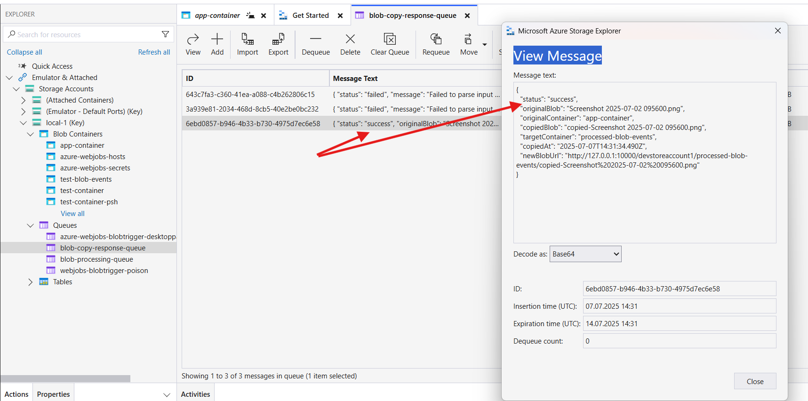
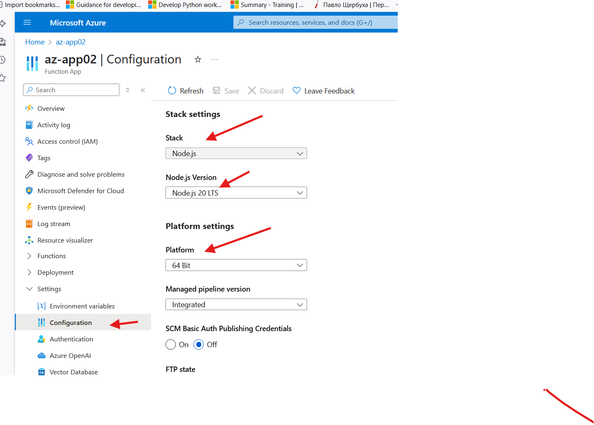
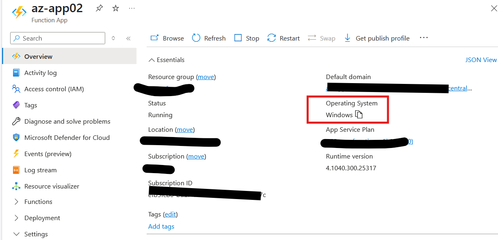

# Вивченя azure function

<!-- TOC BEGIN -->

- [1. Ліник на користну документацію](#p1)
- [1.1. Додаткові міркування, з документації](#p1.1.)
- [2. Набір простих функцій з http  триггером для azure function V4](#p2)
- [2.1. fuction createPaymrent](#p2.1.)
- [2.2. function deletePayment</a>](#p2.2.)
- [2.3.function listPayment](#p2.3.)
- [2.4. function uploadReport](#p2.4.)
- [2.5. function uploadBlob](#uploadBlob)
- [2.6. function downloadBlob](#p2.6.)
- [2.7. function downloadMultyBlob](#p2.7.)
- [3. Набір простих функцій з timer триггером для azure function V4](#p3)
- [4. Набір простих функцій з BlobStorage trigger  для azure function V4](#p4)
- [5. Прототип розподіленого додатку, що використовує BlobStorage](#p5)
- [5.1. Коротенька ідея додатку](#p5.1.)
- [5.2. функція, що має Blob Trigger  та публікує повідомлення в Azure Queue storage](#p5.2.)
- [5.3. Функція-consumer повідомлень з Azure Queue storage](#p5.3.)
- [5.4. Додаткові міркування про чергу Azure Queue storage](#p5.4.)
- [6. Робота з локальним проектом функцій](#p6)
- [6.1. Створити шаблон функцій](#p6.1.)
- [6.2. Сворити самі функції функції](#p6.2.)
- [6.3. Запустити функції локально](#p6.3.)
- [7. Публікація локального проекта в хмару -без CI/CD](#p7)
- [7.1. Login в хмару](#p7.1.)
- [7.2. Публікація фунцій локального проету az-app01 в хмарний](#p7.2.)
- [7.3. Отримати перелік фукнцій, що розгорнулися](#p7.3.)
- [7.4. Підключитися до потокових логів функціонального додатку в хмарі - log streaming](#p7.4.)


## Мій check list

<body>
Чекліст для розробки Azure Functions v4

<input disabled="" type="checkbox"> Проект створено через Azure Functions Core Tools (або VS Code).

<input disabled="" type="checkbox"> Для HTTP-тригерів використовується app.http(...).

<input disabled="" type="checkbox"> Для отримання даних з тіла запиту:

<input disabled="" type="checkbox"> JSON: await request.json()

<input disabled="" type="checkbox"> FormData: await request.formData()

<input disabled="" type="checkbox"> Для query-параметрів: request.query.get('param')

<input disabled="" type="checkbox"> Для логування: context.log(), context.error()

<input disabled="" type="checkbox"> Відповідь повертається через { status, jsonBody }

<input disabled="" type="checkbox"> Локальний запуск і тестування виконані (func start)

<input disabled="" type="checkbox"> Debug працює у VS Code

<input disabled="" type="checkbox"> Деплой через CLI або GitHub Actions

<input disabled="" type="checkbox"> Документація під рукою
</body>


## <a name="p1">1. Ліник на користну документацію</a>

- [HTTP Request](https://learn.microsoft.com/en-us/azure/azure-functions/functions-reference-node?tabs=javascript%2Cwindows%2Cazure-cli&pivots=nodejs-model-v4#http-request)

- [Azure Functions Node.js developer guide](https://learn.microsoft.com/en-us/azure/azure-functions/functions-reference-node?tabs=javascript%2Cwindows%2Cazure-cli&pivots=nodejs-model-v4)

обов'язково звернути увагу на те, що дивишся в версію V4!

- [Code and test Azure Functions locally](https://learn.microsoft.com/en-us/azure/azure-functions/functions-develop-local?pivots=programming-language-javascript)

-[Azure Functions Core Tools reference](https://learn.microsoft.com/en-us/azure/azure-functions/functions-core-tools-reference?tabs=v2)

- [Monitor executions in Azure Functions](https://learn.microsoft.com/en-us/azure/azure-functions/functions-monitoring#stream-logs)


- [Azure Functions triggers and bindings](https://learn.microsoft.com/en-us/azure/azure-functions/functions-triggers-bindings?tabs=isolated-process%2Cnode-v4%2Cpython-v2&pivots=programming-language-javascript)

- [Azure Functions best practices](https://learn.microsoft.com/en-us/azure/azure-functions/functions-best-practices?tabs=csharp)

- [Azure Functions samples](https://github.com/Azure/azure-functions-nodejs-worker/tree/v4.x/samples)

- [Best practices for secrets in Azure Functions](https://learn.microsoft.com/en-us/azure/azure-functions/security-concepts#secrets)


- [local.settings.json reference](https://learn.microsoft.com/en-us/azure/azure-functions/functions-develop-local?pivots=programming-language-javascript#local-settings-file)


- [Use the Azurite emulator for local Azure Storage development](https://learn.microsoft.com/en-us/azure/storage/common/storage-use-azurite?tabs=visual-studio%2Cblob-storage#use-the-azurite-emulator-for-local-azure-storage-development)

Azurite open-source emulator  надає можливість створити безкоштовне локальне середовище для тестування Azure Blob,  Queue Storage, and Table Storage додатків. Коли додатко задовільно працює локально, тоді можна переключитися на реальний Azure Blob Storage. Емулятор працює для платформ Windows, Linux та macOS.

Коли встановили бібліотеки, потрібно скачати і встановити  додатковий продукт:  [Azure Storage Explorer](https://azure.microsoft.com/en-us/products/storage/storage-explorer).

**Для локального підключення:**
- Додати підключення:
Attach to a local emulator
Виберати (Local and Attached) → Local Emulator → Blob Containers
Тепер можна побачите всі контейнери та файли у локальному Azurite.


**Azure CLI**
Переглянути контейнери, **але з локальним емулятором CLI не працює**. Тобто для локального емулятора використовуємо тільки [Azure Storage Explorer](https://azure.microsoft.com/en-us/products/storage/storage-explorer) або  API. 

```bash
az storage container list --connection-string ""
```

Переглянути blobs у контейнері:

```bash
az storage blob list --container-name <container-name> --connection-string "UseDevelopmentStorage=true"
```

3. Вручну у файловій системі
Azurite зберігає дані у папці, яку  вказали при запуску (наприклад, ./azurite-data).
Там можна побачити структуру контейнерів і файлів, але це не дуже зручно для перегляду вмісту.

Рекомендація:
Для зручності використовувати Azure Storage Explorer — це найзручніший і наочний спосіб для роботи з Azurite Blob Storage локально.


- [Blob trigger for Azure Functions Node.js v4](https://learn.microsoft.com/en-us/azure/azure-functions/functions-bindings-storage-blob-trigger?tabs=python-v2%2Cisolated-process%2Cnodejs-v4%2Cextensionv5&pivots=programming-language-javascript)

- [Working with blobs](https://learn.microsoft.com/en-us/azure/azure-functions/storage-considerations?tabs=azure-cli#working-with-blobs)

- [Команди CLI  az functionapp](https://learn.microsoft.com/en-us/cli/azure/functionapp?view=azure-cli-latest)

### <a name="p1.1.">1.1. Додаткові міркування, з документації</a>

- Збереження secrets:

Всі секрети (ключі, connection strings) мають зберігатися у local.settings.json (при локальній розробці), який не пушиться у git. Для продуктива secrets  зберігаються у змінних середовища або в Key Vault для production.

- Про CI/CD:

Для production-деплою краще використовувати CI/CD (GitHub Actions, Azure DevOps), а не ручний publish. Але при розробці ручне завантаження програмного коду досить швидкий шлях для розгортання функцій **під час розробки**.

- Про Application Insights:

Для production рекомендується підключати Application Insights для моніторингу та алертів.

- Про оновлення залежностей:

Регулярно треба оновлювати не лише Core Tools, а й npm-залежності проекту (npm update). 

- Про безпеку:

Не зберігати секрети у README, .http-файлах чи тестових скриптах — використовувати змінні середовища.

- Про cleanup:

Після тестування в хмарі не забувати видаляти непотрібні ресурси, щоб не витрачати кошти.


- Про середовище виконання:

    - Node.js v4 (Isolated Worker Model) — сучасний стандарт для нових проектів.
    - Для старих проектів може бути v3 (Classic Model).

- Про налаштування локального середовища

    - Файл local.settings.json не деплоїться в Azure, але зручно зберігати secrets/connection strings для локальної розробки.

    - Для секретів у хмарі — використовувати Azure Key Vault або Application Settings (env змінні).

    - При розробці Node.js v4 (Isolated Worker Model) зразу треба переходити на синтаксис  **ES Modules** але мати на увазі, що багато прикладів можуть бути написані в класичному синтаксисі.  Для синтаксису **ES Modules** треба побовязково додат в package.json  радок: **"type": "module"**:

```json
    {
      "name": "",
      "version": "1.0.0",
      "description": "",
      "main": "src/functions/*.js",
      "type": "module",   //<------додати рядок
      "scripts": {
        "start": "func start",
        "test": "echo \"No tests yet...\""
      },
      "dependencies": {....}
    }
```
**Мікс використання функцій в різному синтаксисі призведе, в майбутньому, до проблем з deployment -  що  явно не діагностуються!!!!**

- Про структуру проекту

    - Код функцій — у functions.

    - host.json — глобальні налаштування функціонального додатку.

    - function.json (у v4 не обов’язковий, але може бути для сумісності).

- Про роботу з іншими тригерами

    - Окрім HTTP, Azure Functions підтримують Queue, Timer, Blob, EventGrid, ServiceBus тощо.

    - Для додавання нових тригерів:

```bash
func new --template "Queue trigger" --name myQueueFunc
```

- Про тестування:

    - Для unit-тестів можна використовувати Jest, Mocha, або інші фреймворки.

    - Для інтеграційних тестів — .http-файли, curl.
Postman не рукомендую тому що дуже скланий. Та і взагалі краще використовувати інструменти, за допомогою яких ти можеш побачити та відчути як працює  протокол. 

- Про best practices:

    - Використовуйте async/await для асинхронних операцій.

    - Обробляйте всі помилки (try/catch).

    - Не зберігайте секрети у коді.

    - Для production — налаштуйте Application Insights для моніторингу.

- Про оновлення інструментів:

Регулярно оновлюйте Azure Functions Core Tools (npm i -g azure-functions-core-tools@4 --unsafe-perm true).

## <a name="p2">2. Набір простих функцій з http  триггером для azure function V4</a>

Функції знаходяться в каталозі: src/function

### <a name="p2.1">2.1. fuction createPaymrent</a>

Моделює CRUD  операцію create.
На вхід приймає json за параметрами платежу. У відповідь повертає trnasactionID.
Тестові скрипт знаходяться в каталозіЖ tests
Протестувати можна скриптом: /tests/test-createPayment.http

Особливість в тому, що отримання тіла запиту є асинхроннми
```js
    const body = await request.json();
    context.log(`Http body: ${JSON.stringify(body)}`);
```

### <a name="p2.2.">2.2. function deletePayment</a>

Моделює CRUD  операцію delete.
На вхід приймає параметр запиту transactionId платежу. У відповідь повертає http 200.
Протестувати можна скриптом: /tests/test-deletePayment.http

### <a name="p2.3.">2.3. function listPayment</a>

Моделює функцію отримання списку транзакцій
На вхід приймає параметр дата операційного дня, для прикладу: pdate='2020-11-21'
Повертаэ масив  транзакцій.
Протестувати можна скриптом: /tests/test-listPayments.http

Ключоав особливості:

- отримання параметрів запиту

```js
    const pdate = request.query.get('pdate'); // Тут запитуємо дату операційного дня
    context.log(`Query parameter pdate: ${pdate}`);
    if (!pdate){
        throw new Error('Query parameter pdate is required');
    }
```
- повернути http status  та json

```js
return { status: 200, jsonBody: { paymentList: plist  }};
```

- логування помилок

```js
         catch (error) {
            context.error(`Error occured: ${error.message}`);
            return { status: 422, jsonBody: { ok: false, message: error.message }};
        }
```

### <a name="p2.4.">2.4. function uploadReport</a>

Тут функція, для завантаження і розбору multipart/form-data.
Протестувати можна через: tests/test-uploadReport.http  або більщ склажніший варіант через curl 1-uploadReport.cmd.
за допомогою 1-uploadReport.cmd завантажується файл reportFile.json  а відповідь зберігається в reportFile.res.

Особливістю функції те, що розбір multipart/form-data уже вбудовано в методи пакета azure і тому пробувати використати звичні інструменти типу busboy чи multyparty  немає сенсу. Воно не працює.

За цим лінком можна прочитати про властивості та методи класа **HTTP Request**, що пристуній в   

```js
    handler: async (request, context) =>
```

[HTTP Request](https://learn.microsoft.com/en-us/azure/azure-functions/functions-reference-node?tabs=javascript%2Cwindows%2Cazure-cli&pivots=nodejs-model-v4#http-request)


### <a name="uploadBlolb">2.5. function uploadBlob</a>
Тут використовується  "більш ускладнений" шаблон, а саме, інтеграціця з az BlobStorage. Розробка цієї функції пічас навчання пов'язана з вирішенням типових бізнес задач, коли вимагається  завантажити файл з локлаьної станції і збререгти дані на BlobStorage. Звичайно, цю задачу можна вирішити і іншими способами:
- [за допомгою утиліти azure AZCOPY ](https://github.com/pavlo-shcherbukha/azlearning/blob/tz-000001/azcopy_p.md);
- за допомогою пакета API [@azure/storage-blob](https://github.com/Azure/azure-sdk-for-js/tree/main/sdk/storage/storage-blob), як це було зроблено мною при написанні [вузла Node-Red  для завантаження файлів на Blob Storage](https://github.com/pavlo-shcherbukha/az-blob-strg-node).

Але розробка цієї функції в процесі вивчення - це як складова цеглинка, що буде використана при розробці більш складних "розподілених" додатків.

Програмний код  функції знаходиться тут: [/src/functions/uploadBlob.js](/src/functions/uploadBlob.js). Для тетсування фукнції використовуються додаткові скрипти:

- 2-uploadBlob.cmd - завантажує reportFile.json з поточного каталога;
- 3-uploadBlob.cmd - завантажує pic-01.png  з каталога ./testimg;
- 4-uploadBlob.cmd - завантажує pic-02.png  з каталога ./testimg;
- 5-uploadBlob.cmd - завантажує pic-03.png  з каталога ./testimg;

Всі файли завантажуються як multypart/form-data. Результат завантаження можна побачити через az bob explorer: [pic-01](#pic-01). У відповідь отримуємо JSON такої структури:

```json

{"ok":true,"message":"File uploaded","fileName":"pic-03.png"}.

```


<kbd></kbd>
<p style="text-align: center;"><a name="pic-01">pic-01</a></p>


### <a name=p2.6.>2.6. function downloadBlob</a>

Ця функція є "обернена" до фугкції [uploadBlolb](#uploadBlolb). Для завантаженя файлу з BlobStorage на локальну станцію користувача можна використати утиліту CLI  azure **AZCOPY**. Але в даному випадку ціль: побудувати складний response. А передати у відповідь,  бінарний файл - це я відношу до складних response. 
Сама функція знаходиться в файлі [/src/functions/downloadBlob.js](/src/functions/downloadBlob.js). Суть функції виконати download  якогось файла, що попередньом був заваниаений на BlobStorage.

Тестові скрипти  виконані на curl в файлі [/tests/6-downloadBlob.cmd](/tests/6-downloadBlob.cmd). Так як вивантажуються бінарні файли, то http-plugin до Visual Studi Code  тут використати не вийде, бо він розуміє тільки текстові дані.

### <a name="p2.7.">2.7. function downloadMultyBlob</a>

Функція вивантажує дані в форматі multipart/form-data.  Ідея в тому, що  вивантажується 2 файли і назва контейнера, з якого вони прочитані. Тобто повертається одне поле і два файла для форми. 
Сама функція знаходиться в файлі [/src/functions/downloadMultyBlob.js](/src/functions/downloadMultyBlob.js), а тестовтй скрипт знаходиться в файлі [/tests/6-downloadMultyBlob.cmd](/tests/6-downloadMultyBlob.cmd).

## <a name="p3">3. Набір простих функцій з timer триггером для azure function V4</a>

Я тут зроблю тільки одну функцію. Тому, що  я поки не бачу такої великої необходності в їх використанні, тому що такого роду функції весь час повинні бути активні - що скоріш за все приведе до додаткових затрат. Як на мене, то краще використати тригери на зміну BlobStorage чи тришер, що слухає BlobQueue.

Сама функція знаходиться в [/src/functions/timerWriteLog.js](/src/functions/timerWriteLog.js). Самі правила запуску записуються в коді 

```js
const { app } = require('@azure/functions');

app.timer('timerFunc', {
    schedule: '0 */1 * * * *', // кожні 1 хвилину
    handler: async (myTimer, context) => {
        context.log('Timer function executed at:', new Date().toISOString());
    }
});
```
або в env  змінних

```json
// local.settings.json
{
  "IsEncrypted": false,
  "Values": {
    "TIMER_SCHEDULE": "0 */1 * * * *"
  }
}
```

```js
const { app } = require('@azure/functions');

app.timer('timerFunc', {
    //schedule: '0 */1 * * * *', // кожні 1 хвилин
    schedule: process.env.TIMER_SCHEDULE
    handler: async (myTimer, context) => {
        context.log('Timer function executed at:', new Date().toISOString());
    }
});

```

Крым того, всі [особливості запуску](https://learn.microsoft.com/en-us/azure/azure-functions/functions-bindings-timer?tabs=python-v2%2Cisolated-process%2Cnodejs-v4&pivots=programming-language-javascript#configuration)  можуть бути прописані теж в коді. 


```js

app.timer('timerFunc', {
    schedule: process.env.TIMER_SCHEDULE, // або прямо рядком
    runOnStartup: true,
    useMonitor: false,
    handler: async (myTimer, context) => { ... }
});
```

Причому, приємно, що функції з тригером  timer  прекрасно працюють під windows  локально.


## <a name="p4">4. Набір простих функцій з BlobStorage trigger  для azure function V4</a>

**Blob Storage Trigger** викликає функцію при появі/зміні файлу у контейнері Blob Storage. Зручно для обробки завантажених файлів, генерації прев’ю, парсингу тощо.

**Документація:**
[Blob trigger for Azure Functions Node.js v4](https://learn.microsoft.com/en-us/azure/azure-functions/functions-bindings-storage-blob-trigger?tabs=python-v2%2Cisolated-process%2Cnodejs-v4%2Cextensionv5&pivots=programming-language-javascript)

[Tutorial: Trigger Azure Functions on blob containers using an event subscription](https://learn.microsoft.com/en-us/azure/azure-functions/functions-event-grid-blob-trigger?pivots=programming-language-javascript)


[Working with blobs](https://learn.microsoft.com/en-us/azure/azure-functions/storage-considerations?tabs=azure-cli#working-with-blobs)


Для розробки функції треба зробити такі кроки:

- Переконатися, що azurite  не запущено, та запустити його

```bash
azurite --location ./azurite-data --debug ./azurite-debug.log
```

- Через az BlobStorage explorer створити Blob  контейнер:
Відкрити Storage Explorer → Local & Attached → Local Emulator → Blob Containers → New Blob Container → test-blob-events

- Створити функцію **blobEventHandler** та написати код функції (це виключно для v-4)

Текст функції  знаходиться в файлі [/src/functions/blobEventHandler.js](/src/functions/blobEventHandler.js). В цій функції включається blob  риггер. Тут треба звернути увагу, що у зв'язку з переходом з версії функцій з v3  на v4 не вся докуентація коректна. Тому, мені ця функція далася дуже важко. Для її роботи  треба зробити на локальному azurite BlobStorage контейнер "test-blob-events". Завантажуючи чи змінюючи в  контенері файли - ця функція буде спрацьовувати. Відповідно, можна запустити розбір файла чи оборобку якогось vedia файла. 


## <a name="p5">5. Прототип розподіленого додатку, що використовує BlobStorage</a>

### <a p5.1.>5.1. Коротенька ідея додатку</a>

Архітектура додатку показана на діаграмі. Під діаграмою наведено опис цієї архутектури.



Опис кожного компонента та потоку:

    azblob_pages["Статична сторінка"]: Це початкова точка, що являє собою статичний веб-сайт , розміщений на Azure Blob Storage, який служить інтерфейсом користувача.

    -- "HTTP GET" --> appwebpages["сторінка для завантаження файлів"]: Користувач переходить на сторінку для завантаження файлів, яка є частиною або отримана зі статичної сторінки.

    appwebpages -- "HTTP POST" --> azf_uploadfile["Завантаження файлу"]: Це ключовий крок. Користувач на сторінці завантаження ініціює HTTP POST запит до Azure Function azf_uploadfile. Ця функція, відповідатиме за прийом multipart/form-data, що містить файл.

    azf_uploadfile -- "az BlobStore API" --> azblob-ifiles["Файли на Blob Storage"]: Azure Function azf_uploadfile після отримання файлу використовуємо Azure Blob Storage API (через @azure/storage-blob) для збереження файлу в контейнер azblob-ifiles на Blob Storage.

    az_on_uploadTrigget["Триггер на файли az BlobStorage"]: Це Azure Blob Trigger Function. Вона автоматично спрацьовує, коли новий файл додається або існуючий файл оновлюється в контейнері azblob-ifiles.

    --"add, update file публікація повідомлення в чергу" --> InputQueue["Черга повідомлень на обробку нових файлів"]: Коли спрацьовує Blob Trigger, замість того, щоб обробляти файл безпосередньо (що може бути довготривалою операцією), вона публікує повідомлення в чергу (InputQueue). Це є звичайною практикою для "розподілених" додатків, оскільки дозволяє розвантажити початкову функцію та забезпечити надійну асинхронну обробку.

    InputQueue -- "Читає повідомлення з чеги" --> azf_fileProcessor["Обробник файлів"]: Це Azure Queue Trigger Function. Вона слухає InputQueue і активується щоразу, коли в черзі з'являється нове повідомлення (наприклад, з посиланням на щойно завантажений файл). Ця функція виконує основну логіку обробки файлу.

    azf_fileProcessor -- "Запис обробленого файлу в інший blob Storage" --> azf_processed_files: Після обробки файлу, azf_fileProcessor зберігає результат (оброблений файл) у іншому Blob Storage контейнері, названому azf_processed_files. Це допомагає розділити вхідні та оброблені дані.

### <a name="p5.2.">5.2. функція, що має Blob Trigger  та публікує повідомлення в Azure Queue storage</a>

Сама функці знаходиться в [/src/functions/appBlobHandler.js](/src/functions/appBlobHandler.js).

**Особливості коду:**

- Перша проблема, з якою зіткнемося, це публікація повідомлення в чергу. Для Node.js V4  публікація повідомлення в чергу, це output binding. Робочий опис і приклад, як зробити зв'язування з StorageQueue для публікації повідомлення в чергу знайдено за лінком [Azure Queue storage output bindings for Azure Functions](https://learn.microsoft.com/en-us/azure/azure-functions/functions-bindings-storage-queue-output?tabs=python-v2%2Cisolated-process%2Cnodejs-v4%2Cextensionv5&pivots=programming-language-javascript). 

    На першому етапі queueOutput треба оголошувати  *перед оголошенням функції-тригера*.

    ```js
        import "@azure/functions-extensions-blob";
        import { app, output } from "@azure/functions"; // Додано 'output'
        import { BlobServiceClient } from "@azure/storage-blob";


        const queueOutput = output.storageQueue({
            queueName: 'blob-processing-queue',
            connection: 'AzureWebJobsStorage',
        });

        app.storageBlob("appBlobHandler", {...})

    ```

- В функцію тригера передається уже посилання в extraOutputs:

    ```js
    app.storageBlob("appBlobHandler", {
        path: 'app-container/{name}', // Переконайтеся, що це ваш контейнер
        connection: 'AzureWebJobsStorage',
        extraOutputs: [queueOutput],
        handler: async (blobContent, context) => {
            context.log(`Blob trigger processing: ${context.triggerMetadata.name}`);

            const blobName = context.triggerMetadata.name;
            const containerName = "app-container"; // Виправлено: щоб відповідало шляху тригера
            ......
    });       
    ```

- Публікація повідомлення робиться дуже просто в рамках **handler**:  handler: async (blobContent, context) => {....});.


    ```js
            const queueData = {
                    blobName: blobName,
                    containerName: containerName,
                    blobSize: blobProperties.contentLength,
                    contentType: blobProperties.contentType,
                    uploadedAt: new Date().toISOString(),
                    blobUrl: blobClient.url
                };
            context.extraOutputs.set( queueOutput, queueData);
            context.log(`Message sent to blob-processing-queue: ${JSON.stringify(queueData)}`);                

    ```

А взагалі, про **inputs**  та **outputs** є сенс почитати за лінком: [Inputs and outputs](https://learn.microsoft.com/en-us/azure/azure-functions/functions-reference-node?tabs=javascript%2Cwindows%2Cazure-cli&pivots=nodejs-model-v4#inputs-and-outputs). По суті, Inputs and outputs мають багато схожого з терміналами вузлів інтеграційних шин. 

Коли  завантажуємо блоб в контейнер **"app-container"** [pic-02](#pic-02).

<kbd></kbd>
<p style="text-align: center;"><a name="pic-02">pic-02</a></p>


Спрацює налаштований тригер, який прочитає властивості збереженого Blob та відправить повідомлення в чергу. І на  [pic-03](#pic-03) можна продивитися це повідомлення.

<kbd></kbd>
<p style="text-align: center;"><a name="pic-03">pic-03</a></p>

Основна ціль цієї вправи: не передавати в чергу великий об'єкт, а передати маленький json  з властивостями того об'єкта, що треба обробити.
Наступним кроком буде прочитати повідомлення з черги і обробити той Blob об'єкт, на який вказує повідомлення, тобто розробити функцію consumer повыдомлення з черги.

### <a name="p5.3.">5.3. Функція-consumer повідомлень з Azure Queue storage</a>

Функція читає повідомлення з черги **blob-processing-queue**. По властивосях повідомлення знаходить та читає blob  об'єкт  та записуэ його в інший контейнер. Після цього публікує повідомлення  в чергу **blob-copy-response-queue**. В чергу **blob-copy-response-queue** публікуються повідомлення при успішній обробці   [pic-05](#pic-05) та при виникненню помилки обробки [pic-04](#pic-04).

<kbd></kbd>
<p style="text-align: center;"><a name="pic-04">pic-04</a></p>


<kbd></kbd>
<p style="text-align: center;"><a name="pic-05">pic-05</a></p>


З цікавого в цій функції:

- Декларація output черги, повторює декларацію з попереднього прикладу:

```js
    import "@azure/functions-extensions-blob";
    import { app, output, input } from "@azure/functions"; // Додано 'input' і 'output'
    import { BlobServiceClient } from "@azure/storage-blob";

    // Оголосіть вихідну прив'язку responseQueueOutput ЗОВНІ функції
    const responseQueueOutput = output.storageQueue({
        name: "responseQueueMessage",
        queueName: "blob-copy-response-queue",
        connection: "AzureWebJobsStorage"
    });
```

- Декларація тригера, що  "слухає" чергу
Документація, на ей тип тригеру можна знайти за лінком [zure Queue storage trigger for Azure Functions](https://learn.microsoft.com/en-us/azure/azure-functions/functions-bindings-storage-queue-trigger?tabs=python-v2%2Cisolated-process%2Cnodejs-v4%2Cextensionv5&pivots=programming-language-javascript). В розділі [Usage](https://learn.microsoft.com/en-us/azure/azure-functions/functions-bindings-storage-queue-trigger?tabs=python-v2%2Cisolated-process%2Cnodejs-v4%2Cextensionv5&pivots=programming-language-javascript#usage) вказано, що якщо контен повідомелння має формат JSON, то повідомлення автоматично  трансформується в json-об'єкт

```text
Access the queue item as the first argument to your function. If the payload is JSON, the value is deserialized into an object.
```
В роздіді [Metadata](https://learn.microsoft.com/en-us/azure/azure-functions/functions-bindings-storage-queue-trigger?tabs=python-v2%2Cisolated-process%2Cnodejs-v4%2Cextensionv5&pivots=programming-language-javascript#message-metadata)  можна побачити можливі властивості повідмолення. На жаль в них немає властивості типу "Content-Type". Тому, consumer  повинен або сам автоматично визначати, або "знати", який  "Content-Type" повідомлення.

```js
app.storageQueue("queueConsumerHandler", {
    queueName: "blob-processing-queue",
    connection: "AzureWebJobsStorage",
    extraOutputs: [responseQueueOutput], // Передаємо оголошений об'єкт
    handler: async (queueItem, context) => {
        context.log(`Queue trigger processed message: ${queueItem}`);
        ...
        ...
        ...
    }
});    
```

**Підсумовуючи:** 
Це з одної сторони "проста" черга, але маэ багато властивостей, специфічних для класичних черг.  

### <a name="p5.4.">5.4. Додаткові міркування про чергу Azure Queue storage</a>

- Про підтримку транзакцій [Poison messages](https://learn.microsoft.com/en-us/azure/azure-functions/functions-bindings-storage-queue-trigger?tabs=python-v2%2Cisolated-process%2Cnodejs-v4%2Cextensionv5&pivots=programming-language-javascript#poison-messages)

```text
When a queue trigger function fails, Azure Functions retries the function up to five times for a given queue message, including the first try. If all five attempts fail, the functions runtime adds a message to a queue named <originalqueuename>-poison. You can write a function to process messages from the poison queue by logging them or sending a notification that manual attention is needed.

To handle poison messages manually, check the dequeueCount of the queue message.
```

Тобто, якщо за 5 спроб не вдалося обробити повідомлення, то воно відправляється в DL/BackOut Queue з назвою **"<оригінальна назва черги>-poison"**. Ну, як на мене - то прекрасна новина - э підтримка транзакцій!


Також важлио знати про налаштування [Peek lock](https://learn.microsoft.com/en-us/azure/azure-functions/functions-bindings-storage-queue-trigger?tabs=python-v2%2Cisolated-process%2Cnodejs-v4%2Cextensionv5&pivots=programming-language-javascript#peek-lock) - це про налаштуквання часу, коли повідомлення з'явиться для повторної обробки.


Ще, важливо знати про налаштування [Polling algorithm](https://learn.microsoft.com/en-us/azure/azure-functions/functions-bindings-storage-queue-trigger?tabs=python-v2%2Cisolated-process%2Cnodejs-v4%2Cextensionv5&pivots=programming-language-javascript#polling-algorithm), який забезпечує експоненциальний алгоритм повернення в чергу, при помилках.

Можливість налаштування залежить від тарифного плану, що використовується:
```text
In regards to billing when hosting function apps in the Consumption plan, you are not charged for time spent polling by the runtime.
```

Ну і ще [Concurrency](https://learn.microsoft.com/en-us/azure/azure-functions/functions-bindings-storage-queue-trigger?tabs=python-v2%2Cisolated-process%2Cnodejs-v4%2Cextensionv5&pivots=programming-language-javascript#concurrency).


Перелічені вище налаштування внсяться в host.json. Шоб довго не шукати, ось лінк на його конфігурацію: [host.json settings](https://learn.microsoft.com/en-us/azure/azure-functions/functions-bindings-storage-queue?tabs=isolated-process%2Cextensionv5%2Cextensionv3&pivots=programming-language-javascript#host-json):

```json
{
    "version": "2.0",
    "extensions": {
        "queues": {
            "maxPollingInterval": "00:00:02",
            "visibilityTimeout" : "00:00:30",
            "batchSize": 16,
            "maxDequeueCount": 5,
            "newBatchThreshold": 8,
            "messageEncoding": "base64"
        }
    }
}
```
## <a name="p6">6. Робота з локальним проектом функцій</a>

### <a name="p6.1.">6.1. Створити шаблон функцій</a>

```bash
# в загальному
func init <projectName> --worker-runtime <runtime> --model <model> --language <lang> --docker
# приклад
func init  az-app01 --worker-runtime node --model v4 --language javascript

```


Пояснення параметрів:

```text
    --worker-runtime <runtime> — вказує середовище виконання (наприклад, node, dotnet, python, powershell, custom)
    --model <model> — для Node.js можна вказати модель:
    v4 (сучасна ізольована модель, рекомендовано)
    v3 (класична)
    --language <lang> — мова (наприклад, javascript, typescript)
    --docker — створити Dockerfile для контейнеризації

```

Документація:
[Azure Functions Core Tools: func init](https://learn.microsoft.com/en-us/azure/azure-functions/functions-core-tools-reference?tabs=v2#func-init)

### <a name="p6.2.">6.2. Сворити самі функції функції</a>

Створити фунцію, для прикладу **listPayments**

```bash

func new --name listPayments --template "HTTP trigger" --authlevel "anonymous"
```

### <a name="p6.3.">6.3. Запустити функції локально</a>

- через CMD

```bash

    func start -- port 7072

```

або по F5 через debugger Visual Studio Code.

## <a name="p7">7. Публікація локального проекта в хмару (без CI/CD)</a>


### <a name="p7.1.">7.1. Login в хмару</a>

```bash
az login --tenant  <YOUR_TENANT_ID>
```

### <a name="p7.2.">7.2. Публікація фунцій локального проету az-app01 в хмарний</a>

Це дозволяє швидко деплоїти  функції у хмару розробнику без CI/CD.

**Перший спосіб просто публікує ваш каталог в хмару**.

Спосіб наче і дієвий. Але при таком підході  з каталога в хмару  будуть передані всі файли, що не стосуються програмного коду: локальні налаштування та секрети, якась документація, файли Visual Studio Code.  Тому такий спосіб на перших порах можливо і підійде, але все ж таки не є безпечним і я не можу його рекомендувати

```bash
func azure functionapp publish az-app01
```

**Додаткові параметри:**

```text
--python / --javascript / --typescript — вказати мову (зазвичай не потрібно, якщо проект вже ініціалізовано)
--publish-local-settings — також публікує локальні налаштування (local.settings.json)
--overwrite-settings — перезаписує налаштування в Azure
--no-build — не виконує збірку перед публікацією
--force — ігнорує попередження
--build remote - віддалена   побдова пакетів (викачування залежностей)
```

**Документація:**
[Azure Functions Core Tools: func azure functionapp publish](https://learn.microsoft.com/en-us/azure/azure-functions/functions-core-tools-reference?tabs=v2#func-azure-functionapp-publish)


**Після кількох дослідів можна зробити такі висновки:**  
- якщо вибираємо  план flex consumption -  то платформа для python  або Node.js тільки Linux. В цьому випадку навіть немає можливості вибору
- якщо вибираємо план consumption -  то можна вибрати Linux (lgacy) або windows
- Деплоймнет командою func azure functionapp publish <appname>  без додаткових опцій завжди потребує локально наявності каталога node-modules (Для Node.js)
І маємо ось такий лог. В якому видно, що deployment  успішний, але фукнцій немає
```text
func azure functionapp publish signapp --javascript
Getting site publishing info...
[2025-07-28T13:08:18.831Z] Starting the function app deployment...
[2025-07-28T13:08:18.838Z] Creating archive for current directory...
Uploading 17,97 MB [##############################################################################]
Deployment in progress, please wait...
Starting deployment pipeline.
[Kudu-SourcePackageUriDownloadStep] Skipping download. Zip package is present at /tmp/zipdeploy/cfec8035-487f-4615-bc27-d46c120a8598.zip
[Kudu-ValidationStep] starting.
[Kudu-ValidationStep] completed.
[Kudu-ExtractZipStep] starting.
[Kudu-ExtractZipStep] completed.
[Kudu-ContentValidationStep] starting.
[Kudu-ContentValidationStep] completed.
[Kudu-PreBuildValidationStep] Skipping pre-build validation (remotebuild = false).
[Kudu-OryxBuildStep] Skipping oryx build (remotebuild = false).
[Kudu-PostBuildValidationStep] starting.
[Kudu-PostBuildValidationStep] completed.
[Kudu-PackageZipStep] starting.
[Kudu-PackageZipStep] completed.
[Kudu-UploadPackageStep] starting.
[Kudu-UploadPackageStep] completed. Uploaded package to storage successfully.
[Kudu-RemoveWorkersStep] starting.
[Kudu-RemoveWorkersStep] completed.
[Kudu-SyncTriggerStep] starting.
[Kudu-CleanUpStep] starting.
[Kudu-CleanUpStep] completed.
Finished deployment pipeline.
[Kudu-SyncTriggerStep] completed.
Checking the app health...Host status endpoint: https://signapp-aaaaaaa.central-01.azurewebsites.net/admin/host/status
. done
Host status: {"id":"3c8caf2420c0cf94a7e7c0f70f60d57b","state":"Running","version":"4.1040.300.0","versionDetails":"4.1040.300-dev.0.0+ade5fa023e0d9c727872871669fd9454a67ec69d","platformVersion":"","instanceId":"29271521-a5bb-482f-8a4c-d6fc27688412","computerName":"","processUptime":28312353,"functionAppContentEditingState":"NotAllowed","extensionBundle":{"id":"Microsoft.Azure.Functions.ExtensionBundle","version":"4.24.2"}}
[2025-07-28T13:10:29.133Z] The deployment was successful!
Functions in signapp:
```
- ДЕплоймент командою func azure functionapp publish <appname> без додаткових модулів відбувається успішно тільки отакою командоб:

'''bash
func azure functionapp publish <appname> --build remote --javascript
'''
Ось отриманий лог:

```text
func azure functionapp publish signapp --build remote --javascript
Getting site publishing info...
[2025-07-28T12:54:48.025Z] Starting the function app deployment...
[2025-07-28T12:54:48.032Z] Creating archive for current directory...
Performing remote build for functions project.
Uploading 17,97 MB [##############################################################################]
Deployment in progress, please wait...
Starting deployment pipeline.
[Kudu-SourcePackageUriDownloadStep] Skipping download. Zip package is present at /tmp/zipdeploy/3eb79cde-e164-4fee-b5f7-2df872ff0e2c.zip
[Kudu-ValidationStep] starting.
[Kudu-ValidationStep] completed.
[Kudu-ExtractZipStep] starting.
[Kudu-ExtractZipStep] completed.
[Kudu-ContentValidationStep] starting.
[Kudu-ContentValidationStep] completed.
[Kudu-PreBuildValidationStep] starting.
[Kudu-PreBuildValidationStep] completed.
[Kudu-OryxBuildStep] starting.
[Kudu-OryxBuildStep] completed.
[Kudu-PostBuildValidationStep] starting.
[Kudu-PostBuildValidationStep] completed.
[Kudu-PackageZipStep] starting.
[Kudu-PackageZipStep] completed.
[Kudu-UploadPackageStep] starting.
[Kudu-UploadPackageStep] completed. Uploaded package to storage successfully.
[Kudu-RemoveWorkersStep] starting.
[Kudu-RemoveWorkersStep] completed.
[Kudu-SyncTriggerStep] starting.
[Kudu-CleanUpStep] starting.
[Kudu-CleanUpStep] completed.
Finished deployment pipeline.
Checking the app health...Host status endpoint: https://signapp-aaaaaaaa.central-01.azurewebsites.net/admin/host/status
. done
Host status: {"id":"3c8caf2420c0cf94a7e7c0f70f60d57b","state":"Running","version":"4.1040.300.0","versionDetails":"4.1040.300-dev.0.0+ade5fa023e0d9c727872871669fd9454a67ec69d","platformVersion":"","instanceId":"33589783-7d5e-41ec-91ca-19cbc01f8c2b","computerName":"","processUptime":13210109,"functionAppContentEditingState":"NotAllowed","extensionBundle":{"id":"Microsoft.Azure.Functions.ExtensionBundle","version":"4.24.2"}}
[2025-07-28T12:58:48.955Z] The deployment was successful!
Functions in signapp:
    downloadBlob - [httpTrigger]
        Invoke url: https://signapp-aaaaa.central-01.azurewebsites.net/api/downloadblob

    ListBlobs - [httpTrigger]
        Invoke url: https://signapp-aaaa.central-01.azurewebsites.net/api/listblobs

    uploadBlob - [httpTrigger]
        Invoke url: https://signapp-aaaa.central-01.azurewebsites.net/api/uploadblob

```


**Другий спосіб полягає в передачі  в хмару наперед підготованого zip - архіву**.

При підготовці zip  архіву ви можете  вибрати тільки наобхідіні  для розгортання файли локального проекту.

```bash
az functionapp deployment source config-zip -g <ваша ресурсна група в хмарі> -n <назва вашого  додатку-функції в хмарі> --src <повний шдях до вашого zip  файлу>

```

**Документація:**
[az functionapp deployment source config ](https://learn.microsoft.com/en-us/cli/azure/functionapp/deployment/source?view=azure-cli-latest#az-functionapp-deployment-source-config)


При підготовці архіву  потрібно включити і катлог node-modules. При розгортанні в хмарі звична команда  **npm install**  не виконується. Документація каже, що це зроблено  в цілях швидкого старту додатку. Тому преред розробкою уважно перевірте, щоб у вас платформа розгортання в хмарі і платформа розробки (локальна) співпадали, а то можуть бути нюанси. 

Після Deployment  бажано перевірити env змінну **WEBSITE_RUN_FROM_PACKAGE**:  WEBSITE_RUN_FROM_PACKAGE=1.
І часто буває так, що при deployment  не вистачає місця. Тут важливо вичистити логи та кеші. тому що у мене помилка виникала часто.


<kbd></kbd>
<p style="text-align: center;"><a name="pic-06">pic-06</a></p>


<kbd></kbd>
<p style="text-align: center;"><a name="pic-07">pic-07</a></p>

### <a name="p7.3.">7.3. Отримати перелік фукнцій, що розгорнулися</a>

Після розгортання важливо впевнитися, а що власне розгорнулося? Отримати відповідь на це питання можно за допомогою команди:

```bash
func azure functionapp list-functions az-app02 --show-keys

```
У відповідь отримаємо щось на кшталт такого:

```text
....\az200-funcs>func azure functionapp list-functions az-app02 --show-keys
Functions in az-app02:
    appBlobHandler - [blobTrigger]

    blobEventHandler - [blobTrigger]

    createPayment - [httpTrigger]
        Invoke url: https://az-app02-............-01.azurewebsites.net/api/createpayment

    deletePayment - [httpTrigger]
        Invoke url: https://az-app02-............-01.azurewebsites.net/api/deletepayment

    downloadBlob - [httpTrigger]
        Invoke url: https://az-app02-............-01.azurewebsites.net/api/downloadblob

    downloadmultyBlob - [httpTrigger]
        Invoke url: https://az-app02-............-01.azurewebsites.net/api/downloadmultyblob

    listPayments - [httpTrigger]
        Invoke url: https://az-app02-............-01.azurewebsites.net/api/listpayments

    queueConsumerHandler - [queueTrigger]

    timerFunc - [timerTrigger]

    uploadBlob - [httpTrigger]
        Invoke url: https://az-app02-............-01.azurewebsites.net/api/uploadblob

    uploadReport - [httpTrigger]
        Invoke url: https://az-app02-............-01.azurewebsites.net/api/uploadreport

```


### <a name="p7.4.">7.4. Підключитися до потокових логів функціонального додатку в хмарі - log streaming</a>

Дозволяє підключитися до потокових логів (log streaming) вашого Function App az-app01 у хмарі Azure в реальному часі.

**Використання:**

Відкрити термінал у каталозі проекту.
Виконати команду.

```bash
func azure functionapp logstream az-app01
```
Дає змогу побачити всі логи, які генерує  функція під час виконання  (наприклад, через context.log, context.error) в реальному часі.


Документація:
[Log streaming for Azure Functions](https://learn.microsoft.com/en-us/azure/azure-functions/functions-monitoring#stream-logs)


